# System Architecture — Lab Day 09

**Nhóm:** Nhóm 08  
**Ngày:** 14/04/2026  
**Version:** 1.0

---

## 1. Tổng quan kiến trúc

**Pattern đã chọn:** Supervisor-Worker kết hợp mạng lưới Tooling qua **MCP Server (HTTP REST)**.  
**Lý do chọn pattern này (thay vì single agent):**
1. **Phân quyền trách nhiệm rõ ràng (Separation of Concerns):** Không phải nhồi nhét ngập ngụa prompt và tools vào một Agent duy nhất (dễ tràn token, hallucinate).
2. **Khả năng quan sát (Observability):** Từng pipeline step (Routing -> Gọi Tool -> Bới DB -> Trả lời) đều được ghi log chi tiết. Dễ debug xem lỗi nằm ở khâu tìm kiếm (Retrieval) hay do LLM suy luận sai (Synthesis).
3. **Mở rộng linh hoạt (Scalability):** Tích hợp khéo léo Client-Server với hệ MCP. Nếu công ty có Tool mới, chỉ cần khai báo ở Server bên ngoài, không cần đụng mã nguồn RAG.

---

## 2. Sơ đồ Pipeline

**Sơ đồ luồng thực thi quá trình của Hệ thống:**

---

## 3. Vai trò từng thành phần

### Supervisor (`graph.py`)

| Thuộc tính | Mô tả |
|-----------|-------|
| **Nhiệm vụ** | Phân tích ý định câu hỏi (intent routing), định tuyến luồng xử lý và đánh giá rủi ro an toàn của task. |
| **Input** | `AgentState` (Mảng thông tin chứa `task` - Câu hỏi đầu vào) |
| **Output** | supervisor_route, route_reason, risk_high, needs_tool |
| **Routing logic** | Rule-based (từ khoá). Chứa "hoàn tiền, cấp quyền, flash sale" -> Policy Tool. Chứa "khẩn cấp, err-" -> Risk High/HITL. Khác -> Retrieval. |
| **HITL condition** | Khởi hoạt khi hệ thống nhận diện câu hỏi chứa mã lỗi lạ (`err-`). Node `human_review` sẽ chạy nhưng hiện tại đang mở chế độ Placeholder (Auto-approving) cho môi trường Lab, duyệt xong sẽ đẩy tiếp qua Retrieval. |

### Retrieval Worker (`workers/retrieval.py`)

| Thuộc tính | Mô tả |
|-----------|-------|
| **Nhiệm vụ** | Tìm kiếm dữ liệu trong ChromaDB (VectorDB) để trả về các đoạn text (chunks) chứng minh sát nhất với câu hỏi. |
| **Embedding model** | Mặc định sử dụng Local Model: `bkai-foundation-models/vietnamese-bi-encoder` (thông qua SentenceTransformers). Chế độ dự phòng (Fallback): Nếu không tải được model local, ưu tiên 2 là `text-embedding-3-small` (OpenAI), ưu tiên 3 là Random Vectors. |
| **Top-k** | Mặc định là 3 (có thể lên 5 nếu sử dụng chế độ hybrid search). |
| **Stateless?** | **Yes** (Xử lý chuỗi độc lập, xong là quên, không nắm giữ cache trạng thái vòng đời sau khi export output). |

### Policy Tool Worker (`workers/policy_tool.py`)

| Thuộc tính | Mô tả |
|-----------|-------|
| **Nhiệm vụ** | Gọi LLM đối chiếu quy định trong văn bản; đóng vai trò là Client thực hiện giao tiếp HTTP ra ngoại vi. |
| **MCP tools gọi** | Gọi qua HTTP 8000: `search_kb`, `get_ticket_info`, `check_access_permission`. |
| **Exception cases xử lý** | Đơn flash sale, sản phẩm kỹ thuật số/license key, hạn mức truy cập Level 3, xử lý ticket ưu tiên P1... |

### Synthesis Worker (`workers/synthesis.py`)

| Thuộc tính | Mô tả |
|-----------|-------|
| **LLM model** | `gpt-4o-mini` (Bản mặc định lấy theo env) hoặc Gemini Flash 1.5. |
| **Temperature** | `0.1` (Thiết lập giá trị siêu thấp để ngăn AI "chém gió" sinh hoang tưởng). |
| **Grounding strategy** | Phân tách rạch ròi System Prompt, chèn "POLICY EXCEPTIONS" lên top trước "CONTEXT" để ép LLM ưu tiên ngoại lệ, ghi nguồn cite góc cuối. |
| **Abstain condition** | Khi biến đầu vào chunk trống, LLM sẽ bị mồi nhử từ chối khéo: "Không đủ thông tin trong tài liệu nội bộ". Cùng việc bị trừ điểm Confidence. |

### MCP Server (`mcp_server.py`)

| Tool | Input | Output |
|------|-------|--------|
| search_kb | query, top_k | chunks, sources |
| get_ticket_info | ticket_id | ticket details |
| check_access_permission | access_level, requester_role | can_grant, approvers |
| create_ticket | priority, title, description | ticket_id, url (Ticket giả lập) |

---

## 4. Shared State Schema

> Liệt kê các fields trong AgentState và ý nghĩa của từng field.

| Field | Type | Mô tả | Ai đọc/ghi |
|-------|------|-------|-----------|
| task | str | Câu hỏi đầu vào | supervisor đọc |
| supervisor_route | str | Worker được chọn | supervisor ghi |
| route_reason | str | Lý do route | supervisor ghi |
| retrieved_chunks | list | Evidence từ retrieval | retrieval ghi, synthesis đọc |
| policy_result | dict | Kết quả kiểm tra policy | policy_tool ghi, synthesis đọc |
| mcp_tools_used | list | Tool calls đã thực hiện | policy_tool ghi |
| final_answer | str | Câu trả lời cuối | synthesis ghi |
| confidence | float | Mức tin cậy | synthesis ghi |
| workers_called | list | Lưu diễn biến (Trace) luồng worker nào đã chạy | Tất cả Node ghi (Append) |
| history | list | Lưu nội dung nhật ký bằng chữ các mốc sự kiện | Lịch sử log (All nodes) |
| risk_high / needs_tool | bool | Cờ hiệu cho biết tính chất nguy hiểm, nhu cầu ra Internet | supervisor ghi / policy đọc |

---

## 5. Lý do chọn Supervisor-Worker so với Single Agent (Day 08)

| Tiêu chí | Single Agent (Day 08) | Supervisor-Worker (Day 09) |
|----------|----------------------|--------------------------|
| Debug khi sai | Khó — không rõ lỗi ở đâu | Dễ hơn — test từng worker độc lập |
| Thêm capability mới | Phải sửa toàn prompt | Thêm worker/MCP tool riêng |
| Routing visibility | Không có | Có route_reason trong trace |
| Security (Bảo mật Tools) | Rủi ro một LLM bị Jailbreak rồi gọi nhầm hàm xoá DB. | Chỉ những Node chỉ định (Policy Worker) mới có quyền truy cập Tool ngoài. |

**Nhóm điền thêm quan sát từ thực tế lab:**

Sau khi chuyển sang kiến trúc Supervisor-Worker tích hợp MCP (FastAPI), mức độ chịu lỗi (Fault-Tolerance) hệ thống tăng hẳn. Giả dụ nếu `mcp_server.py` phản hồi trên 10s (timeout do sập mạng ngầm), chỉ có `policy_tool_worker` bị rớt log lỗi khâu đó, và Worker `synthesis` sau đó vẫn hoàn thành nốt luồng câu trả lời một cách êm đẹp dựa trên partial context. Đây là đặc tính cực kì đáng giá trong Production mà single agent cũ (gãy là gãy toàn tập) không có được.

---

## 6. Giới hạn và điểm cần cải tiến (Hướng code thực nghiệp)

> Nhóm mô tả những điểm hạn chế của kiến trúc hiện tại và nêu ra hướng để làm thật.

1. **Routing quá cứng nhắc (Rule-based ở Supervisor):** File `graph.py` hiện tại định tuyến bằng cách bắt keyword `if any(kw in task...)`. Nếu user dùng từ đồng nghĩa, routing sẽ đi sai đường. 
  * **Hướng thực thi:** Sửa hàm `supervisor_node()` thay vì `if-else` hãy gọi API gpt-4o-mini với chức năng Structure Output (Function Calling), để LLM tự quyết định route nào hợp lý nhất bằng Semantic hiểu biết.
2. **Công cụ External ở MCP chỉ là Hardcode:** Các thông số `MOCK_TICKETS` trong `mcp_server.py` đang tạo ra bằng code cứng (dict) - không chạy thật với doanh nghiệp.
  * **Hướng thực thi:** Bạn cần bổ sung thư viện `httpx` vào trong file `mcp_server.py`. Tìm hàm `tool_get_ticket_info(ticket_id)` -> Đổi nó thành gọi API nội bộ tới nền tảng Atlassian Jira của công ty (`POST /rest/api/3/issue/...` kèm Header chứa Token).
3. **Môi trường mất trí nhớ - Thiếu Long-Term Memory:** Hiện tại Pipeline (graph.py) chỉ chạy dạng One-off (hỏi 1 câu trả lời 1 khối rồi tắt). Nó quên khuấy bối cảnh nếu user hỏi tiếp câu thứ 2 (Follow-up chat).
  * **Hướng thực thi:** Bạn có thể cần bổ sung một Backend Memory (ví dụ dùng Redis, Sqlite hoặc Checkpointers của framework LangGraph gốc). `AgentState` sẽ cần nạp thêm property `"messages": list` lưu lại lịch sử hội thoại thay vì chỉ lưu 1 biến `task` thô.
